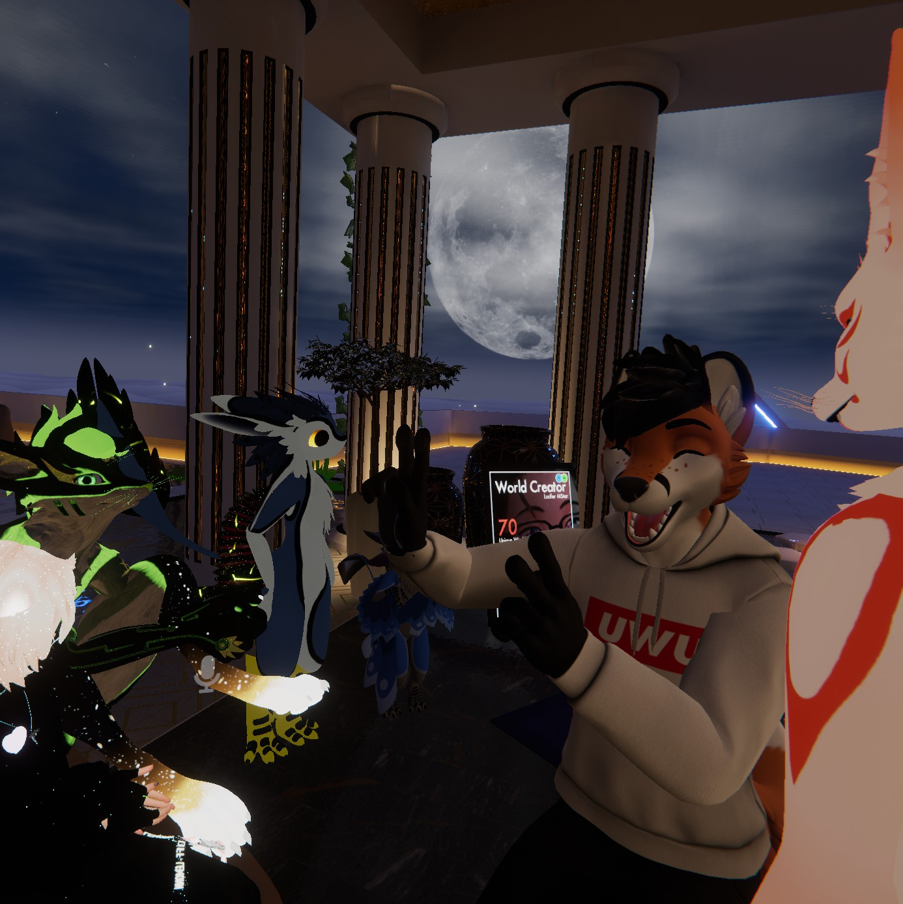
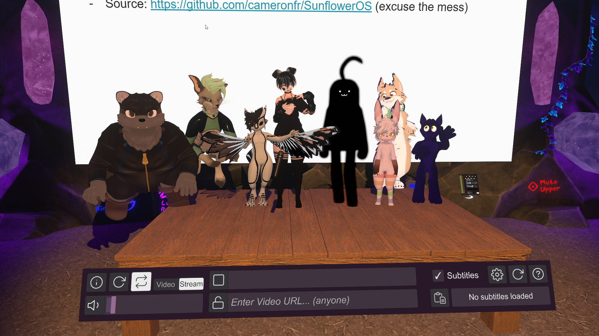
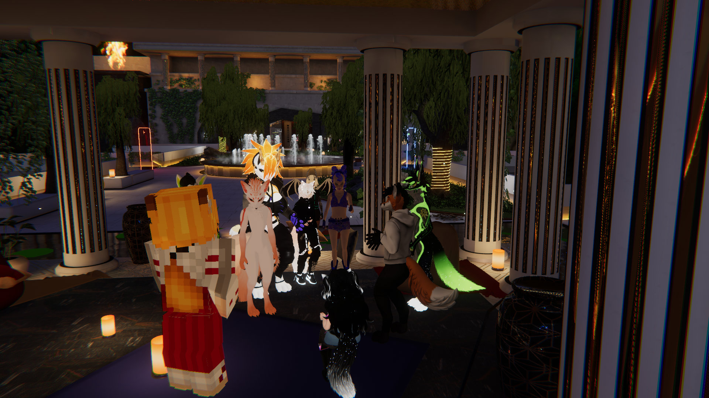
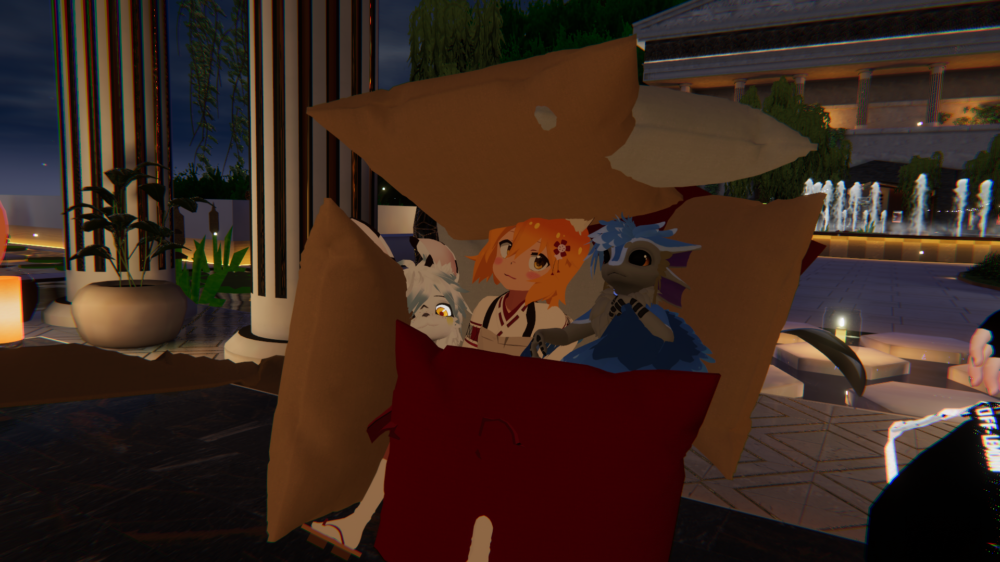
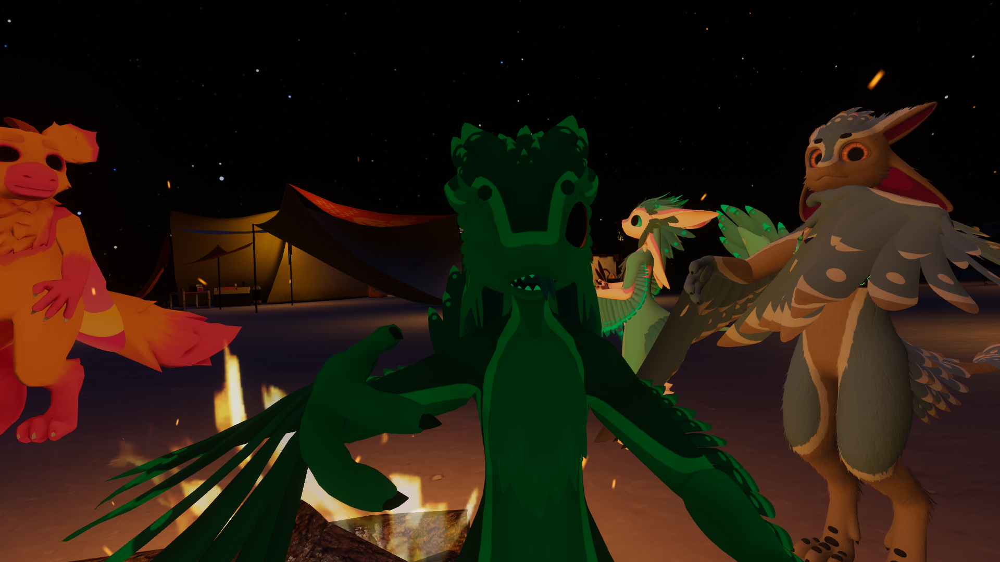
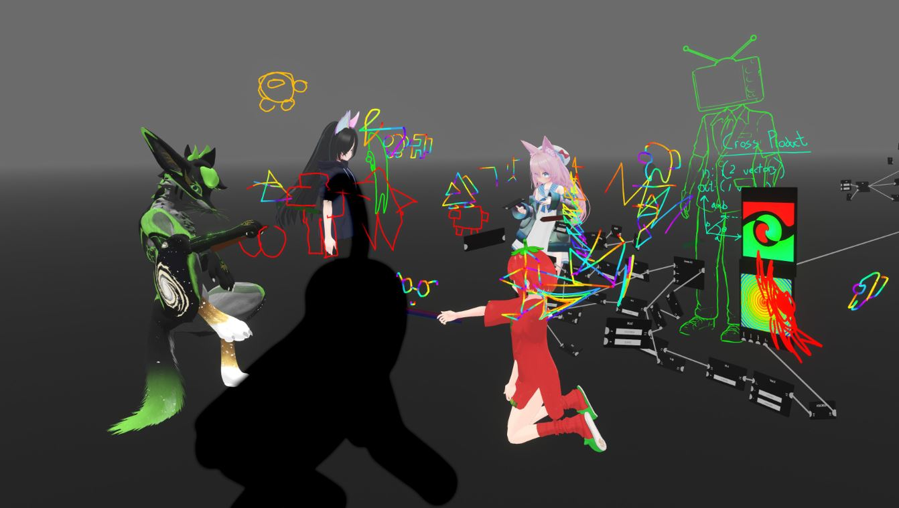
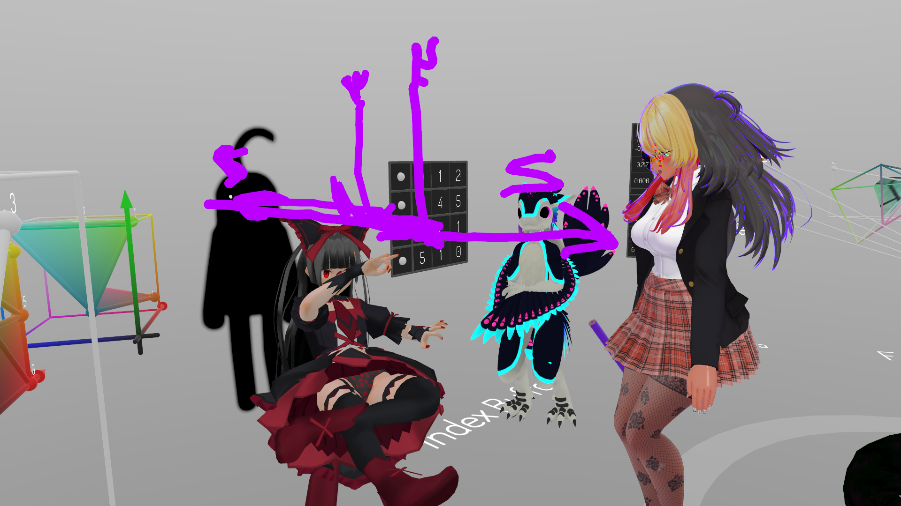

## Welcome to Metacosmic Genesis

We are a community of friendly ambitious minds. We welcome humans, post-humans, AIs, etc that want to aim for constant improvement and a better future. Among us you'll find [transhumanists](https://en.wikipedia.org/wiki/Transhumanism), furries, researchers, entrepeneurs, [effective accelerationists](https://effectiveaccelerationism.substack.com/p/repost-notes-on-eacc-principles-and) (e/accs), [effective altruists](https://www.effectivealtruism.org/) (EAs), (post/meta-)rationalists, engineers, musicians, XR junkies, bio-hackers who somehow vibe together, and aim for for rational collective liberty and cosmic wonder:3

We are always evolving, but united by ideas such as curiosity to learn and explore, desire to create and improve, freedom, and a passion for futuristic tech like AI, XR, and BCIs:>

We call the community itself MetaGen+, to represent the idea that we are open to people that we may not be expecting (hence the '+'). We want to be an inclusive, open, and respectful community!

## Participate:>

To join, you can join our [discord](/discord), [VRChat group](https://vrc.group/MGEN.2812), and our events! You can also hang out in 2D:> at [meet.metagen.ai](https://meet.metagen.ai/)

__Things we do__

1. Discuss, learn, share ideas, about stuff like BCI, VR, AI, transhumanism, furries, science, philosophy, electronics, art 
2. Hang out/socialize
3. Explore VR and the world
4. Create and build things together
5. Have fun, inspire, care for each other

We have most of our meetups in VR (VRChat, NeosVR, ChilloutVR, Somnium space), but we are also exploring mixed reality events between VR and 2D platforms (like workadventure/gather town). We like exploring all the social VR platforms too!:>

We record all our educational events, and [you can check them out on YouTube](https://www.youtube.com/playlist?list=PLmwqDOin_Zt48iB6dzKmE3tLdWqxTc3ha)

Our server is very free and open, but we aim to follow these two rules at least:

1. Be compassionate to other fellow creatures 
2. Have fun

