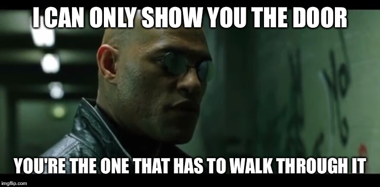

## Welcome to Metaverse Genesis

MetaGen is a project to explore and develop the intersection between AI and VR/AR. 

The main aim is to develop open datasets and open source machine learning models, and related tools, that build on the rich multimodal data that VR and 3D technologies offer. The current project is to develop generative models of motion (conditioned on other modalities), and trained from VR data. However, the vision, explained below, is much larger. Ultimately, we want to understand intelligence and keep exploring what lies beyond:)

<!-- [Short poll to gauge interest in participating in VR studies](https://docs.google.com/forms/d/e/1FAIpQLSfRyX7R4qXIbF6BtlOYhl9KmB-XZyGaQIwxAunAsdBfJ6mI3w/viewform) -->

''Recording of talk on the project''

<iframe width="560" height="315" src="https://www.youtube.com/embed/Rt9xe8bGKDo" title="YouTube video player" frameborder="0" allow="accelerometer; autoplay; clipboard-write; encrypted-media; gyroscope; picture-in-picture" allowfullscreen></iframe>
  

<!-- Recording tool released! -->

<!-- <iframe width="560" height="315" src="https://www.youtube.com/embed/PgQmuIQYoBE" frameborder="0" allow="accelerometer; autoplay; clipboard-write; encrypted-media; gyroscope; picture-in-picture" allowfullscreen></iframe> -->

<!-- <big>[Join our discord server](http://discord.gg/HQ8Crcw)</big> -->

## Motivation

You may be asking yourself: what does this mean for me?
Well, it depends on who you are, and what things you care about of course.

What I can tell you is that the goal of this is foundational science and technology, which can have impact in many things. Here are some I can think of.

### Cognitive and behavioural sciences
We want to understand the subtle things that humans intuitively know, but machines currently have no way of knowing. Furthermore, even though we intuitively know these things, can we say that we understand them? Think of things like: how do I judge how someone else is feeling, when I am speaking with them? Conversely, how do I express feelings with some intent in mind? How do humans know which places are interesting to explore, when they enter a new unknown environment? Or what questions to ask when you meet a new person?

Gut-feelings, emotions, knee-jerk reactions, subconcious perceptions, judgements, consciousness. We all know these things. They are the very essence of what makes us human. And we've wondered about them since humans have been able to wonder. Yet, only in the last century of so, have we developed tools precise, and safe enough, and methodologies designed carefully enough, to be able to get a little bit deeper into their mysteries. Psychology has gathered large amounts of observational records of what people do and how they behave. Neuroscience has begun to connect these behaviours with the underlying machinery of our biology and below.

However, probing deep into the brain is a risky business; even more so if you want to "play" with it and see how it reacts to stimuli. We don't yet have good enough brain-computer interfaces to throw the wonders of computational science at the hard problem of the brain. So, **how close can we get to the brain with the technology we have today?**

Virtual reality is the latest advance in Human-Computer interaction. It connects our senses, and our actions directly to a computer. What you see, hear, feel, and what you do, say , and express, are all being digitalized. In the age of big data and machine learning, the opportunity is clear. We have the tools to answer hard questions, like the ones we posed above (and have been posing for a long time), *if* we have enough data. And we have the technology to gather that data. Answering hard questions (science), is also how we make the biggest breakthroughs in solving hard problems (engineering), in this case the problems related to the mind and human behaviour.

Let me be clear: I don't think VR will give us all that we need to fully answer these questions and solve these problems. We will almost certainly need to [dig deeper into the brain](https://neuralink.com/). But I think there is a big chance it can still lead to big advances in the above things.

### AI research

Even if the progress in the above quesionts is limited, the progress in AI *technologies* may be more noticable. I have made a case [in this post](https://www.linkedin.com/pulse/crowdsourcing-human-level-ai-through-social-vr-guillermo-valle/) that models that learn from human-produced data have made impressive progress in restricted domains like [text](https://www.gwern.net/GPT-3), image understanding, speech comprehension, etc, and we are beginning to understand the properties of this advancements, like how much data and compute are needed.

I argued that for multimodal understanding (related to the subtle questions about emotion perception, etc. I mentioned above), we are currently primarily **data-limited**. 

Therefore, to advance AI research in this important direction we need, like above, multimodal data abou how humans speak, move, and behave, in different situations, represented by the stream of multi-sensory stimuli (hearing, vision, touch, etc). The kind of data that VR makes available in digital form.

### Games and animation

Just look at this video

<iframe width="560" height="315" src="https://www.youtube.com/embed/pe-YTvavbtA" frameborder="0" allow="accelerometer; autoplay; clipboard-write; encrypted-media; gyroscope; picture-in-picture" allowfullscreen></iframe>

This technology will have a huge impact in the fields of animation, and AI in games. More realistic characters, more autonomy, diversity, etc.

But that video is only the beginning. Those characters currently don't see, or hear, or feel anything. To solve those problems will require some clever ideas in model design. But as I mentioned in the previous section, my experience tells me that the main bottleneck is data. The models in the video above are trained on a few tens of hours of data at most. VRChat generated 16 million hours of VR data in 2018 alone. I am not kidding when I say that I think the difference between a standard game NPC and a virtual being that is able to understand your feelings and, perhaps, have some proto-versions of them itself, is one year of VRChat data (or something equivalent). Some more recent evidence towards this is [this new work by deepmind](https://www.youtube.com/watch?v=b-fvsi9YIP4) showing that they could learn to ground language in an interactive setting, with enough data (about 20K hours) of humans interacting in their simplified environment.

I think getting agents with intuition and common sense is also the beginning. Giving them [autonomy and curiosity](https://www.youtube.com/watch?v=7bJ0fnvPLaA) is the next step in the path towards sparking the Metaverse with life, intelligence, and whatever else may lie in the infinite depths of the computational universe (see the awesome work on [Lenia](https://twitter.com/BertChakovsky/status/1316402836880547841) for example).

### Entertainment and more

Virtual beings that are more human-like would enable whole new game and entertaining experiences. Imagine the first truly AI VTuber, or an AI friend who gets to know you and offer you support, or whatever you may (reasonably) need.

Imagine a virtual coach that teaches you to dance, or to do public speaking, or to get better at emotional intelligence, and can understand how and why you fail, and how you can do better. Imagine autocomplete, but where it's funny not because of how stupid it is, but because it actually makes witty suggestions which make sense *in context*.

### Biotechnology and digital twins

As XR technologies, digitize more and more about us, new challenges and opportunities emerge. The opportunity comes from the potential uses of large scale datasets of correlated biometrics, for medicine and biotechnology. Widespread digital twins (imagine [this](https://3d4medical.com/) but with molecular detail, real time, and personalized to each of us) would revolutionize medicine. It is also a stepping stone towards [digital immortality](https://www.wikiwand.com/en/Digital_immortality). The challenges lie in the creation of systems that facilitate data availability for research while ensuring ethical uses, privacy, and agency of data owners, and other stakeholders.

Regarding the opportunities, one can look at existing projects attempting to enable large scale and ethical use of biomedical data for research. [The UK Biobank](https://www.ukbiobank.ac.uk/) has longitudinal data (i.e. data of the same person collected over time) for 500,000 participants, for a variety of biomarkers (including blood samples and general physiolgical metrics). With this data, scientists are [understanding the long-term role of diet on diseases](https://www.ukbiobank.ac.uk/learn-more-about-uk-biobank/our-impact/the-connection-between-diet-and-health), enabling life-saving early-detection of [dementia](https://www.ukbiobank.ac.uk/learn-more-about-uk-biobank/our-impact/spotting-dementia-early) and [cancer](https://www.ncbi.nlm.nih.gov/pmc/articles/PMC7226426/), among many others. Similar projects are ongoing in other countries, like [Japan](https://biobankjp.org/english/), [China](http://www.shbiobank.com/), [US](https://www.joinallofus.org/) and [others](https://www.biobanking.com/10-largest-biobanks-in-the-world/).

This projects are already saving and improving many lives. However, technology is giving us the opportunity to scale this up, and advance biomedical knowledge much much further. Scaling up biomedical data collection while keeping ethical standards and security is a challenge though. Some organizations are exploring solutions for this challenge. [OpenHumans](https://www.openhumans.org/) is taking the approach of giving data owners full agency over what happens over their data, by letting them decide in a granular way what data is shared with whom for which purpose. However, this approach has limits. Right now, OpenHumans relies on a community governance approach to veto projects that are allowed to request data. It is unclear how scalable this is, and how amenable to abuse, or error. [OpenMined](https://www.openmined.org/) is attempting to go further by relying on cryptographic techniques to achieve trust-less access to data for machine learning. This is one of the biggest challenges in medicine in the coming decades, and also one of the most important ones to solve!

## How?

The tl;dr is: data. The more the better. The higher the quality and the diversity, the better. The more open, transparent, and publicly available for the advancement of science, the better. The more we can reward the participants and volunteers who donate *their* data, and their time, and work, the better.

These are not easy things to achieve. But they are definitely not impossible. I have been working as hard as I can to solve the technical hurdles (https://github.com/MetaGenAI/MetaGenNeos https://github.com/oxai/vrai), but that alone means nothing, without **people**. I want everyone to own this project and this vision. *I can only show you the door; you are the one that has to walk through it*. 

Please, super most definitely contact me (@guillefix in twitter) if you want to help with technical or social aspects of this project. But the easiest thing everyone can contribute just by virtue of being human (or sentient) is data. Your data can be worth more than ads. Your data could be our data *communism anthem plays* (lol, ok that sounds creepy). Seriously, you have the freedom to do whatever you want with your data. I'm just showing you one cool thing you can do with some bits of it, if you want. You always choose what to share or not to share. (but really, we could do super cool things:)).

<!-- ## What? -->

<!-- Many things. We have a bunch of projects in development. -->

<!-- For one of them, we are looking for VR dancers to gather data from their dancing. We wanna teach an AI to dance. We think it would be a cool project to start with, and showing the scientific community the value of this idea, while having fun!  -->

<!-- We are also looking for other kinds of data, and we are offering some NCR for it. You can check out more at the [MetaGen Data Challenge](datachallenge.html). -->
<!-- The data will be made publicly available for other researchers to use, and the tools will be open sourced. -->

<!-- More recently, we are looking to pay people to do certain kinds of simple social activities and play games in VR. Check out this [short poll to gauge interest in participating](https://docs.google.com/forms/d/e/1FAIpQLSfRyX7R4qXIbF6BtlOYhl9KmB-XZyGaQIwxAunAsdBfJ6mI3w/viewform). -->

Contact me [@guillefix](https://twitter.com/guillefix) on twitter, or guillefix#5692 on discord, or ｇｕｉｌｌｅｆｉｘ＠ｇｍａｉｌ．ｃｏｍ, if you're interested

<big>[Join our discord server](http://discord.gg/HQ8Crcw)</big>
