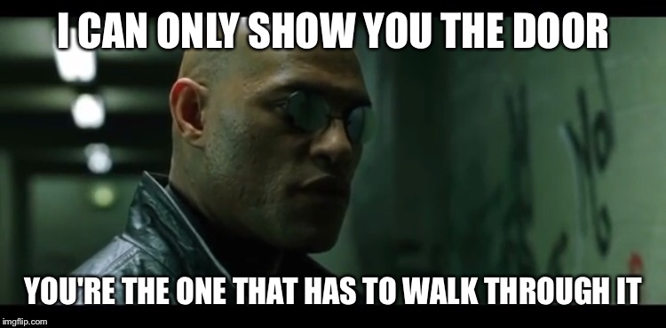

## 後世世へようこそ

MetaGenは、AIとVR/ARの間の交差点を調査し、開発するプロジェクトです。

<big>新しい録音ツールがリリースされました！</big>

<iframe width="560" height="315" src="https://www.youtube.com/embed/PgQmuIQYoBE" frameborder="0" allow="加速度計；自動再生；クリップボードの書き込み；暗号化されたメディア；ジャイロスコープ；ピクチャインピクチャー"許可全画面></iframe>

<big>[ディスコードサーバーに参加](http://discord.gg/HQ8Crcw)</big>

## なぜ？

自問自答するかもしれません。これは私にとって何を意味するのですか。
まあ、あなたが何者で、もちろん、何を気に掛けるのかによります。

私が皆さんにお話しできるのは、この目標は基礎科学と技術であり、多くのことに影響を与える可能性があるということです。私が考え付くことのできるものはこれです。

### 認知科学と行動科学
人間が直感的に知っている微妙なものを理解したいと思っていますが、機械は今のところ知る術を持っていません。それに、直感的に知っているのに、理解していると言えますか？次のようなことを考えてください。相手と話している時、他の人の気持ちをどう判断すればいいのか？逆に、意図を持って感情を表現するにはどうすればいいのでしょうか。新しい未知の環境に入った時、人間はどの場所が探索に興味を持つかどうやって知るのでしょう？または、新しい人に会った時に尋ねる質問は？
本能的な感情、感情、膝を動かす反応、軽い認識、判断、意識。我々は皆知っている。彼らは私たちを人間にする本質だ。人間が不思議に思うようになってから、私たちは彼らを不思議に思っている。しかし、その前世紀に入ってから、私たちは正確で安全なツールや、慎重に設計された方法論を開発し、彼らの謎を少し深く掘り下げることができました。心理学は、人々の行動や行動に関する観測記録を大量に集めてきた。神経科学は、こうした行動を、私たちの生物学の基礎となる機構以下と結びつけ始めた。

しかし、脳の奥深くを調べるのは危険な仕事です。もっと多くの場合、刺激に対して「遊び」、それがどのように反応するかを見たいと思うなら。脳の難問に計算科学の驚異を投げかけるのに十分な脳コンピューターのインターフェースを持っていない。それで、**今のテクノロジーを使用して、脳にどの程度近づくことができますか？**

バーチャル・リアリティは、人間とコンピューターの対話における最新の進歩です。それは私たちの感覚と行動をコンピュータに直接結び付ける。見る、聞く、感じる、何をする、言う、表現するかは、すべてデジタル化されています。ビッグデータや機械学習の時代には、その機会は明らかだ。上に挙げた（そして長い間ポーズをとってきた）ような、十分なデータがある場合には*、*質問に答えるツールがあります。そして、私たちはそのデータを収集する技術を持っている。厳しい問題（科学）に答えることは、私たちがハードな問題（エンジニアリング）を解決する上で最も大きな進歩を遂げる方法でもある。この場合、精神と人間の行動に関連する問題である。

はっきりさせてください。VRは、これらの質問に十分に答え、これらの問題を解決するのに必要なすべての情報を提供してくれるとは思いません。私たちは、[脳をもっと深く掘り下げる](https://neuralink.com/)が必要になるでしょう。 しかし、私は、それが上記の事に大きな進展をもたらす可能性はまだあると思う。

### AI調査

上記の問題の進捗が限られていても、AI *技術*の進歩が目立つかもしれません。私は、人間が作ったデータから学ぶモデルが、[text](https://www.gwern.net/GPT-3)や画像理解、音声理解などの制限された分野で、目覚しい進歩を遂げたという事例を作り上げ、データや計算の量など、この進歩の性質を理解し始めた。

私は、マルチモーダル理解（前に述べた感情の知覚に関する微妙な問題などに関連する）のために、私たちは現在、主に**データ制限**されていると主張した。

したがって、この重要な方向にAI研究を進めるには、上のように、多感覚刺激（聴覚、視覚、タッチなど）の流れに代表されるさまざまな状況での人間の話し方、動き方、振る舞い方に関する多峰性データが必要です。 VRがデジタル形式で利用できるデータの種類。

### ゲームとアニメーション

このビデオを見て

<iframe width="560" height="315" src="https://www.youtube.com/embed/pe-YTvavbtA" frameborder="0" allow="加速度計；自動再生；クリップボードの書き込み；暗号化されたメディア；ジャイロスコープ；ピクチャインピクチャー"許可全画面></iframe>

この技術は、アニメの分野やゲームのAIに大きな影響を与えるだろう。より現実的な性格、より自治性、多様性など

でもそのビデオは始まりにすぎない。現在、それらのキャラクターは何も見たり、聞いたり、感じたりしません。これらの問題を解決するには、モデルデザインにいくつかの賢いアイデアが必要になります。しかし、前の節で述べたように、私の経験から、主なボトルネックはデータであることが分かります。上のビデオのモデルは、最大でも数十時間のデータに関するトレーニングを受けています。VRChatは2018年だけで1,600万時間のVRデータを生成しました。私が言うのは、標準的なゲームNPCと、あなたの気持ちを理解できる仮想的な存在との違い、そしておそらくは、それ自体のプロトバージョンがVRChatデータ（あるいはそれと同等のもの）の1年間だと思う時です。

直感と常識を持つエージェントを手に入れるのも始まりだと思う。Metaverseに[autonomy and quoritity](https://www.youtube.com/watch?v=7bJ0fnvPLaA)を与えることは、生命や知性、その他の何が計算上の宇宙の無限の深さに存在するかについて、Metaverseを引き出すための次のステップです(例えば、[Lenia](https://twitter.com/BertChakovsky/status/1316402836880547841)での素晴らしい作業を参照)。

### エンターテイメントなど

より人間的なバーチャルな存在は、全く新しいゲームや楽しい体験を可能にします。最初の真のAI VTuber、つまりあなたを知り、サポートを提供してくれるAIの友人、あるいはあなたが（合理的に）必要とするものを想像してみてください。

ダンスを教えたり、公の場で話したり、感情的な知性を高めたり、失敗した理由や失敗した理由を理解したり、より良い方法を教えるバーチャル・コーチを想像してみてください。オートコンプリートを想像してみてください。しかし、おかしいのは、それがどんなに愚かかかったかではなく、実際には、「文脈の中で」意味のある、機知に富んだ提案をするからです。

## 方法

tl;dr:データ。もっと良くなる。質や多様性が高ければ高いほど良い。科学の進歩のために、よりオープンで、透明で、公然と利用できるものほど、より良いものになります。「彼らのデータ」を寄付した参加者やボランティアに報酬を与えれば与えるほど、報酬を与えることができ、時間と仕事を与える時間が増えます。

これらは簡単に達成できない。でも絶対に無理じゃない。私は技術的な問題を解決するために、できる限りの努力をしてきました(https://github.com/MetaGenAI/MetaGenNeos https://github.com/oxai/vrai)。しかし、それだけでは**people**がなければ、何の意味も持ちません。私は皆にこのプロジェクトとこのビジョンを所有して欲しい。*ドアを見せるしかない。あなたは、その中を歩かなければならない人です。*

このプロジェクトの技術面や社会的側面について助けたい場合は、ぜひ、最も強く私に連絡してください(Twitterでは@guillefix)。しかし、人間（あるいは感傷的）であることだけで、誰もが貢献できる最も簡単なことは、データである。広告よりもデータの価値が高くなる可能性があります。あなたのデータは、私たちのデータ*共産主義アンテムが再生する*かもしれません(（lol，それは不気味に聞こえる）。 まじめに、データを自由に操作できます。少しでもいいから、君に見せてあげたいんだ。共有する対象と共有しない対象を常に選択します。（でも、本当はすごくクールなことができるのよ）。

## 何？

