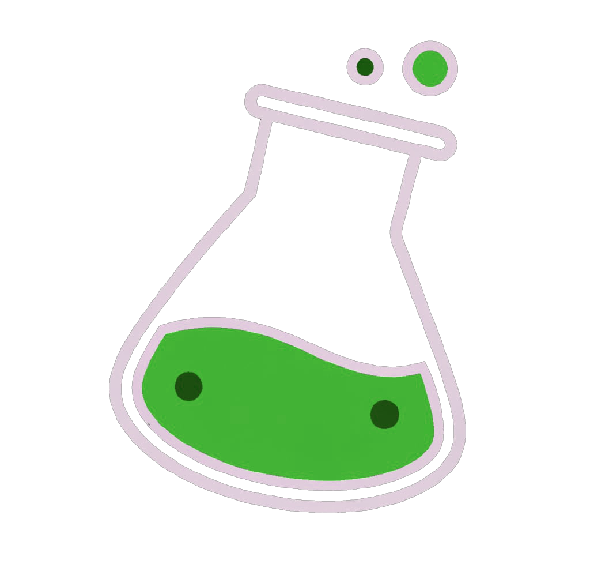

MetaGen Labs is where we turn ideas into reality. Our mission is to use our collective knowledge and skills to explore, experiment, and develop new ideas that align with our values of curiosity, freedom, inclusivity, playfulness and health. We are particularly interested in technologies that extend what's possible, such as AI, XR, and BCI, as they may unlock futures that are more awesome than we can currently imagine.

Our projects will be time-bounded and intended to make us learn, so we call them explorations. Every quarter we gather a crew to embark on a new adventure or adventures, while keeping close ties with the rest of our MetaGen+ community, and our place in the world at large.

Interested in joining our journey? We'd love to hear from you! Join our discord and get to know us better, or leave your email below to stay up-to-date with the latest explorations and MetaGen Labs news.

<!-- Begin Mailchimp Signup Form -->
<link href="//cdn-images.mailchimp.com/embedcode/classic-071822.css" rel="stylesheet" type="text/css">

    <form action="https://metagen.us12.list-manage.com/subscribe/post?u=1f20a8bfa0ab845e054bdeed2&amp;id=d05b72eeda&amp;f_id=004f42e0f0" method="post" id="mc-embedded-subscribe-form" name="mc-embedded-subscribe-form" class="validate" target="_blank" novalidate>
        

        
        
* indicates required

	<label for="mce-EMAIL">Email Address  *
</label>
	<input type="email" value="" name="EMAIL" class="required email" id="mce-EMAIL" required>
	

	

		

		

	
    <!-- real people should not fill this in and expect good things - do not remove this or risk form bot signups-->
    
<input type="text" name="b_1f20a8bfa0ab845e054bdeed2_d05b72eeda" tabindex="-1" value="">

        

            

                <input type="submit" value="Subscribe" name="subscribe" id="mc-embedded-subscribe" class="button">
                

            

        

    

</form>

<!--End mc_embed_signup-->

# Explorations

## Longevity World

This quarter we are aiming to build the most inspirational educational experience about longevity technologies, as a world in VRChat.

Check our [Notion page](https://thunder-zinc-cf1.notion.site/Longevity-Edu-inspirational-VRChat-world-238632ca7ffd4903bd398a6ab32687d9) and the longevity-world channel on our discord to see progress

# Further explorations

## [MetaGenAI](/ai)

Bringing AI to the Metaverse, and viceversa
                                                                                        
### [Tools](/tools)

### [Research](/research)

## Community projects

On tops of the Labs and other longer term MetaGen projects, we have a channel on [our discord](/discord) where anyone can share or collaborate on projects big or small! Go check them out
