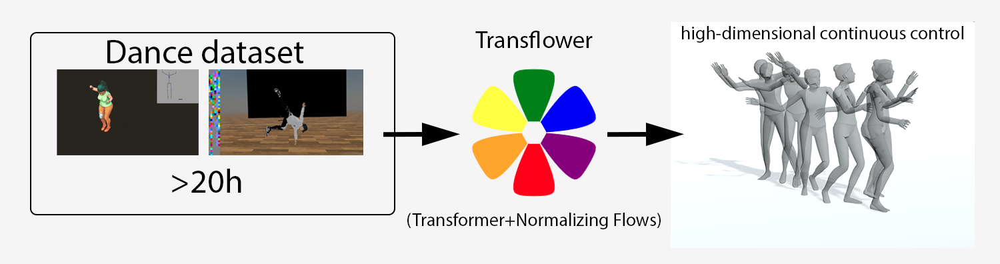

    <ul>
        <li>
            

            <a href="#" target="_blank">
                
<i class='fa fa-file-alt'></i>

                
Paper

            </a>
            

        </li>
        <!-- <li>
            

            <a href="#dance-dataset">
                
<i class='fa fa-database'></i>

                
Dataset

            </a>
            

        </li> -->
        <li>
            

            <a href="https://github.com/guillefix/transflower-lightning" target="_blank">
                
<i class='fa fa-github'></i>

                
Code

            </a>
            

        </li>
        <li>
            

            <a href="https://colab.research.google.com/drive/1SBEJZp3TdVbgjAP9pwsTPqaefK3QuUVj" target="_blank">
                
<svg role="img" viewBox="0 0 24 24" xmlns="http://www.w3.org/2000/svg"><title>Google Colab</title><path d="M16.9414 4.9757a7.033 7.033 0 0 0-4.9308 2.0646 7.033 7.033 0 0 0-.1232 9.8068l2.395-2.395a3.6455 3.6455 0 0 1 5.1497-5.1478l2.397-2.3989a7.033 7.033 0 0 0-4.8877-1.9297zM7.07 4.9855a7.033 7.033 0 0 0-4.8878 1.9316l2.3911 2.3911a3.6434 3.6434 0 0 1 5.0227.1271l1.7341-2.9737-.0997-.0802A7.033 7.033 0 0 0 7.07 4.9855zm15.0093 2.1721l-2.3892 2.3911a3.6455 3.6455 0 0 1-5.1497 5.1497l-2.4067 2.4068a7.0362 7.0362 0 0 0 9.9456-9.9476zM1.932 7.1674a7.033 7.033 0 0 0-.002 9.6816l2.397-2.397a3.6434 3.6434 0 0 1-.004-4.8916zm7.664 7.4235c-1.38 1.3816-3.5863 1.411-5.0168.1134l-2.397 2.395c2.4693 2.3328 6.263 2.5753 9.0072.5455l.1368-.1115z"/></svg>

                
Colab

            </a>
            

        </li>
    </ul>

<!-- image here -->

<!-- # Overview video -->

    <iframe width="560" height="315" src="https://www.youtube.com/embed/uBnCePehA-Y" title="YouTube video player" frameborder="0" allow="accelerometer; autoplay; clipboard-write; encrypted-media; gyroscope; picture-in-picture" allowfullscreen></iframe>

 

# Abstract

Dance requires skillful composition of complex movements that follow rhythmic, tonal and timbral features of music. Formally, generating dance conditioned on a piece of music can be expressed as a problem of modelling a high-dimensional continuous motion signal, conditioned on an audio signal. In this work we make two contributions to tackle this problem. First, we present a novel probabilistic autoregressive architecture that models the distribution over future poses with a normalizing flow conditioned on previous poses as well as music context, using a multimodal transformer encoder. Second, we introduce the currently largest 3D dance-motion dataset, obtained with a variety of motion-capture technologies, and including both professional and casual dancers. Using this dataset, we compare our new model against two baselines, via objective metrics and a user study, and show that both the ability to model a probability distribution, as well as being able to attend over a large motion and music context are necessary to produce interesting, diverse, and realistic dance that matches the music.

# Generated dance samples

## Samples in NeosVR

These samples are rendered in NeosVR using [a tool to work with motion data in Neos](https://github.com/MetaGenAI/MetaGenNeos). NeosVR is a social VR platform which means these dances can be used as part of multiplayer VR experiences. NeosVR applies a small amount of smoothing to the motion.

<iframe width="33%" height="175px" src="https://www.youtube.com/embed/04V317oQNGE" title="YouTube video player" frameborder="0" allow="accelerometer; autoplay; clipboard-write; encrypted-media; gyroscope; picture-in-picture" allowfullscreen></iframe>
<iframe width="33%" height="175px" src="https://www.youtube.com/embed/mcbvkhVL1pI" title="YouTube video player" frameborder="0" allow="accelerometer; autoplay; clipboard-write; encrypted-media; gyroscope; picture-in-picture" allowfullscreen></iframe>
<iframe width="33%" height="175px" src="https://www.youtube.com/embed/jE3OhKRIAYg" title="YouTube video player" frameborder="0" allow="accelerometer; autoplay; clipboard-write; encrypted-media; gyroscope; picture-in-picture" allowfullscreen></iframe>

## Transflower fine tuned samples
Next we show some samples of the raw generated motions. Note that in these videos the seed is all the same (fixed to one of the casual dancing seeds).

<iframe width="33%" height="175px" src="https://www.youtube.com/embed/YELdaaqnNVA" title="YouTube video player" frameborder="0" allow="accelerometer; autoplay; clipboard-write; encrypted-media; gyroscope; picture-in-picture" allowfullscreen></iframe>
<iframe width="33%" height="175px" src="https://www.youtube.com/embed/z02r5lnl30o" title="YouTube video player" frameborder="0" allow="accelerometer; autoplay; clipboard-write; encrypted-media; gyroscope; picture-in-picture" allowfullscreen></iframe>
<iframe width="33%" height="175px" src="https://www.youtube.com/embed/s5btAp5Wcp0" title="YouTube video player" frameborder="0" allow="accelerometer; autoplay; clipboard-write; encrypted-media; gyroscope; picture-in-picture" allowfullscreen></iframe>

## Transflower samples

<iframe width="33%" height="175px" src="https://www.youtube.com/embed/wXQoDdG5lZw" title="YouTube video player" frameborder="0" allow="accelerometer; autoplay; clipboard-write; encrypted-media; gyroscope; picture-in-picture" allowfullscreen></iframe>
<iframe width="33%" height="175px" src="https://www.youtube.com/embed/_XLnWf-oS_E" title="YouTube video player" frameborder="0" allow="accelerometer; autoplay; clipboard-write; encrypted-media; gyroscope; picture-in-picture" allowfullscreen></iframe>
<iframe width="33%" height="175px" src="https://www.youtube.com/embed/OVRvq_hiH_Q" title="YouTube video player" frameborder="0" allow="accelerometer; autoplay; clipboard-write; encrypted-media; gyroscope; picture-in-picture" allowfullscreen></iframe>

You can see a few more samples in [this playlist](https://www.youtube.com/watch?v=_XLnWf-oS_E&list=PLmwqDOin_Zt51HuQnUJsYFDppubKaATlT&index=7&ab_channel=GuillermoValle)
 

# Architecture

The architecture consists of a full-attention transformer encoder which encodes the multimodal context, and conditions a normalizing flow generator which models a probability distribution over future motions.

## Pretrained models

These are the trained checkpoints for the transflower model in [the code](https://drive.google.com/file/d/1db1-1ksa_1eSFCYVFSCTXuIweKRK-etv/view?usp=sharing).

[Trained transflower](https://drive.google.com/file/d/1Po9vUrJSFTCdYiX6q70erSQXg3XBPPtN/view?usp=sharing)

[Trained transflower (other checkpoint)](https://drive.google.com/file/d/1db1-1ksa_1eSFCYVFSCTXuIweKRK-etv/view?usp=sharing)

[Trained transflower fine tuned](https://drive.google.com/file/d/12AOzS5fr3J2Hr6ENVu5Gq7NyWkcd78X8/view?usp=sharing)

We are working on training models on the full dataset, and we will release those too as sonn as they are ready.

### Baselines

[Trained MoGlow](https://drive.google.com/file/d/1ZON89enzJ4XQAn8c_IkqwqFV_AELS16c/view?usp=sharing)

[Trained AIC](https://drive.google.com/file/d/1iU3rh1GYGHvsPAsyz2AWp4u6--41jRfj/view?usp=sharing)

# Dance dataset

We are compiling the dataset, which comprises several sources, and will release it soon. 

Some parts of the dataset are already publicly available. The AIST++ dataset is available [here](https://google.github.io/aistplusplus_dataset/factsfigures.html), and most of the VR dances are available from several playing lists including [this one](https://www.youtube.com/playlist?list=PLfUjxoRin1rx2QEsMHGPrcJk8kghQ7CBP), [this one](https://www.youtube.com/playlist?list=PLfUjxoRin1rwh6iHNIL5A1n7TmJ9s1Oz-), [this one](https://www.youtube.com/playlist?list=PLmwqDOin_Zt4WCMWqoK6SdHlg0C_WeCP6) and [this channel](https://www.youtube.com/channel/UCpf29wLMtgWZHljBD2rZZQQ). These dances can all be visualized in 3D in the VRChat world Papa Dance by lox9973. The VR dance videos can be converted to bvh (and retargetted to any humanoid skeleton) using [this Unity tool](https://github.com/guillefix/shadermotion-bvh-utils), and the features processed as explained [in the code](https://github.com/guillefix/transflower-lightning). However, we will release the full set of features soon, so that it will be easier to replicate and build on this dataset:)

---

### BibTex

### Acknowledgements

I (Guillermo) would like to thank lox9973 for his invaluable help in getting the VR dance data, both by making the mocap recording tool, and for finding dancers to participate. I'd also like to thank Konata and Max for being the first participants to donate data to the project. Thank you for beliving in it:) Thank you also to the coathors in the paper without whom this idea wouldn't have happened, and to the friends supporting me during this project including Shin, lox, Kazumi, Choco, Sirkitree, among others. Finally, I'd like to thank Idris for the compute resources in Jean Zay, and the Google cloud research credits programs (including TRC) for their support. Both of these also made the project possible!