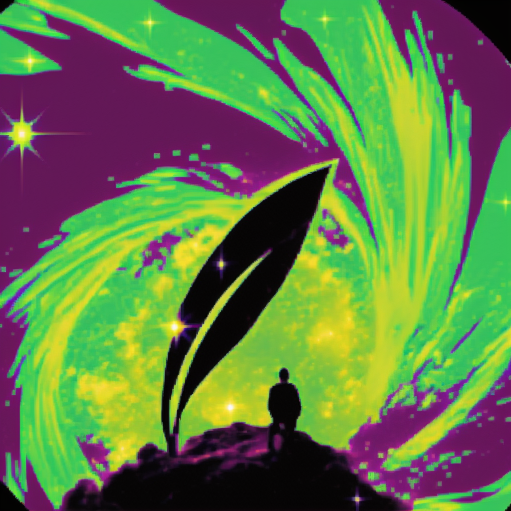

At MetaGen we are a vision of a [positive future](https://www.existentialhope.com/) based on critical understanding of the cosmos.

### Aspiration

We aspire for a future full of love and wonder for every being. We also think that we don't really even have the concepts to describe what the future holds, so we approach it with curiosity and wonder. We are bullish on technologies that help us explore what's possible. Remember: beyond the ordinary, lies the extraordinary. Ultimately, we believe in a future with quasi-infinite potential; that no matter how far we go, there's always more to discover and create; That problems are unavoidable, but problems are solvable; that the Cosmos is full beyond measure of elegant Truths and potential for Beauty Unimaginable. That we are always children playing at the shores of the cosmic ocean -- at the beginning of infinity.

Our values we strive for can't be neatly summarized in words of course, but here's our best attempt:

1. Make the world awesome
2. Explore with wonder and curiosity
3. Live in a VR/XR/augmented magical world
4. Make life be and feel fun, playful, full of wonder and love
5. Develop good mental health and support each other
6. Make healthy and menaningful relationships and friendships
7. Make furries (morphological freedom) real
8. Cognitive Liberty!
9. Learning about the Cosmos / getting closer to Truths
10. Cosmic Harmony

### Understanding

Through science, philosophy, and art, we try to understand the cosmos, and create new things. We organize our explorations in different categories, the main ones being

* **Philosophy and rationalism** -- the foundations
* **Dance, movement, and robotics** -- Movement is fundamental. How do we move, how do things move, how we can make things move?
* **Uwuneering** -- the term we use to describe "engineering for empowering people (to pursue happiness)", including morphological freedom and cognitive liberty
* **XR and neurotech** -- technology connecting biology and bio-minds to other computing systems
* **Generative AI** -- including language models, image and music generation, and many more.
* **Shaders, Artificial life, and procedural generation** -- including creative coding stuff, and exploration of the computational universe
* **Bio and nanotech** -- How can we understand and control matter from its smallest constituents up
* **Space-time exploration** -- Cosmographia, how do we explore the vastness of space and time, and what do we find? Energy, being another fundamental physical quantity is discussed here too.
* **Cognitive science, AI, neuroscience, and psychology** -- how do minds work?
* **Social science, economics, ecology, systems science** -- the study of complex systems -- large collections of interacting components.

## [MetaGenAI](/ai) <small>-- a vision of the interaction between AI and XR</small>

## Blog

Coming soon
