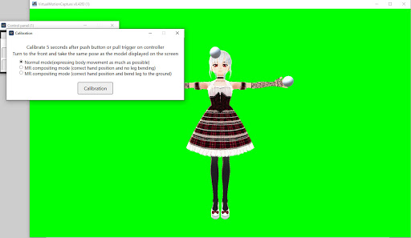
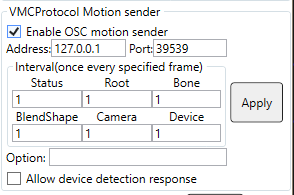
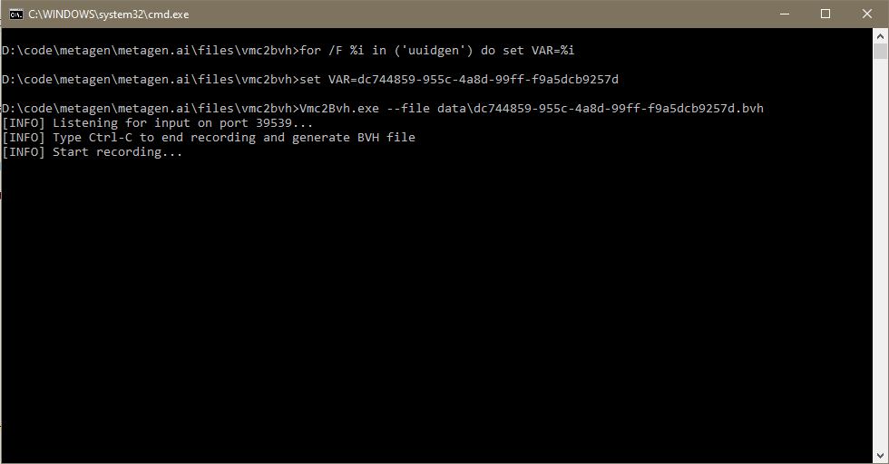

This page explains how to record motion data using VMC, in BVH format. You can use this to do "home mocap" to easily create animations, or to do VR [lifelogging](https://www.wikiwand.com/en/Lifelog) (best way to approximate immortality / keep a record of yourself!), to help in the [metagen project](index.html), or anything else you may want!

## Basic set up of VMC

**You can skip this section if you already have VMC setup**

1. Download the paid version of VMC, which supports broadcasting the data using websockets. You can get it [here](https://akira.fanbox.cc/) or in [his patreon](https://www.patreon.com/sh_akira). You can also contact me (@guillefix on twitter or guillefix#5692 on discord) if you want to give it a try, but you should support him through those means if you plan to use the tool regularly.
2. Import VRM avatar by clicking on "Open VRM" in the Control Panel and then "Import VRM". You can choose your own VRM avatar, or use [this free one](https://drive.google.com/file/d/1T8WAUYqWxbNQUVaL7Mq2KbgkE-VnYde7/view?usp=sharing).
3. Calibrate by pressing "Calibration". You can select the normal mode, and then press "Calibration" on the Calibration pop up. Then make sure yo place the three balls representing head, hands, and other trackers, at the correct points in the T-posed avatar. You can see more info at [https://vmc.info/](https://vmc.info/). 
</img>
4. Optionally you can calibrate the hand rotation on the settings's in the "Hand rotate fix" section, as well as enable Lip tracking (blendshape data like this will be saved into a json file)

## Setting OSC Motion sender

1. Click on "Settings" on the Control Panel
2. Find the section named "VMCProtocol Motion Sender" on the right of the window
3. Tick the checkbox "Enable OSC Motion sender"
4. Set the Address to `127.0.0.1` and the port to `39539`. The settings should look like the image below

</img>

## Running vmc2bvh to record the motion data

1. Download my version of vmc2bvh from [here](/files/vmc2bvh/vmc2bvh.zip) and unzip the file.
2. *(Optional). Start OBS now. If you want to record the motion syncced to some video and/or audio data (e.g. for dancing, or playing some VR game), you should start OBS first. The vmc2bvh executable will play a beep sound when it starts recording, so that later, the recorded video/audio can be syncced with the motion.*
3. While VMC is running (with the OSC motion sender set up as described in the previous section), **execute the batfile `run_vmc2bvh.bat`**. As mentioned above, it will emit a beep sound when the motion recording begins. <small>You may need to allow it through Windows Defender if you get a windows saying "Windows protected your PC". Click More Info, and then Run anyway. You may also need to allow it through the firewall.</small>
4. When you want to finish the recording, press ctrl+C twice on the terminal which is running vmc2bvh.exe.

</img>

You can see the sourcecode of my version of vmc2bvh [here](https://drive.google.com/file/d/1jvg1RH5SToPVWI5YPQH17XMkUesxjyen/view?usp=sharing), and see some extra options in the original repository by infosia [here](https://github.com/infosia/vmc2bvh), which you can use by editing the bat file, if desired.

The files will be inside a folder called `data`, given some unique ID filename. You can now open the BVH files in Blender, or use them as you wish. Blendshape data is stored in .BLEND.json files.
